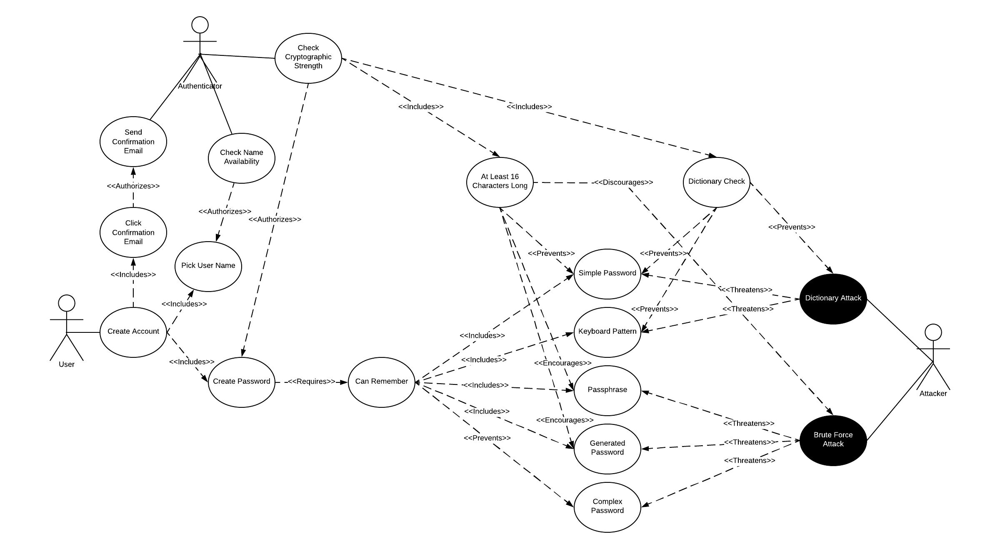
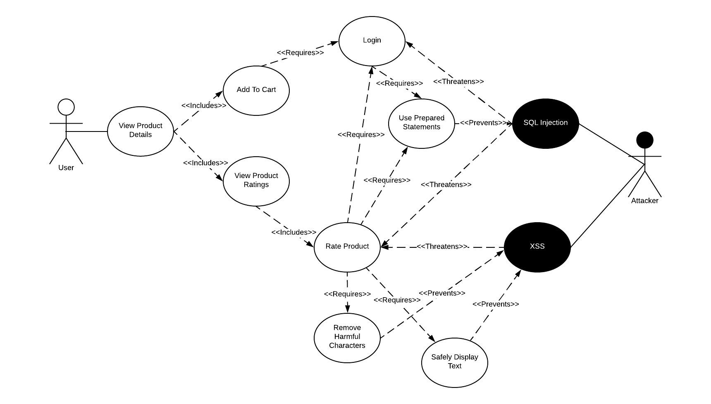
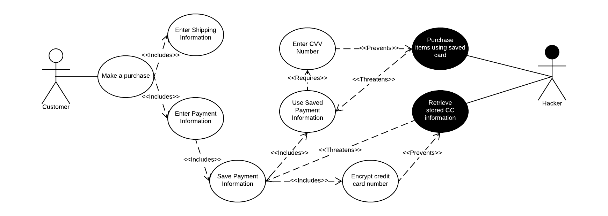

# Requirements for Software Security Engineering

## Use Cases and Misuse Cases

All LucidChart diagrams are available at https://app.lucidchart.com/invitations/accept/2c9fcfe6-8eb9-4e8a-8bd3-dc143cb7393c

### Case 1: Create an Account
User stories:
* As a customer, I want to create an account in the Spring Store so that I can use them for all my spring related needs.
* As a customer, I want to be able to use a password so I can log into my account later.

Derived security requirements:
* The system must be able to uniquely identify each account with a username and password.
* The system must provide the ability to encrypt data at rest and decrypt it when needed.
* The system must have a secure password checking mechanism.

### Case 2: Login to Account
User stories:
* As a customer, I want to return to my account in the Spring Store so that I can use them for all my spring related needs.
* As a customer, I want to be able to reuse a password so I can log into my account again.

Derived security requirements:
* The system must be able to uniquely identify each account with a username and password.
* The system must provide the ability to encrypt data at rest and decrypt it when needed.
* The system must have a secure password checking mechanism.

### Case 3: Browse Inventory
User stories:
* As a customer, I want to search the Spring Store inventory so that I can use them for all my spring related needs.
* As a customer, I want to be able to add items to my shopping cart for immediate or later purchase.
* As a customer, I want to be able to view product ratings.
* As a customer, I want to be able to add product ratings.

Derived security requirements:
* The system must provide the ability to encrypt data at rest and decrypt it when needed.
* The system must have a secure text entry checking mechanism.

### Case 4: Make a purchase
User stories:
* As a customer, I want to purchase springs through Spring Store so that I can use them for all my spring related needs.
* As a customer, I want to be able to save my payment and shipping information for the next time I check out so that I can purchase springs more quickly in the future.

Derived security requirements:
* The system must provide the ability to encrypt data at rest and decrypt it when needed.
* The system must have a secure password checking mechanism.

### Case 5: Manage a Vender Account
User stories:
* As a vender, I want to access the Spring Store payment system API so that I can use them to sell my spring-related products.
* As a vender, I want to access the Spring Store customer address DB so that I can use them to sell my spring-related products.
* As a vender, I want to access the Spring Store shipping API so that I can use them to sell my spring-related products.
* As a vender, I want to access the Spring Store 3rd-Party inventory DB so that I can use them to sell my spring-related products.

Derived security requirements:
* The system must provide the ability to encrypt data at rest and decrypt it when needed.
* The system must provide account authorization protection. 
* The system must have a secure password checking mechanism.

## Alignment of Security Requirements with Spring Security
Assess the overall alignment of our security requirements with the advertised features of the software.

## Spring Security Documentation Review

Spring Security, and the Spring Framework as a whole, tends to have very good documentation, and has put a lot of work into making installation simple through the use of Maven and Gradle. Within the project itself, the documentation consists of a manual containing guides on various topics such as [Security HTTP Response Headers](https://github.com/spring-projects/spring-security/blob/master/docs/manual/src/docs/asciidoc/_includes/reactive/exploits/headers.adoc), and various sample applications designed to show users how to implement use cases such as [OAUTH2 authorization](https://github.com/spring-projects/spring-security/tree/master/samples/boot/oauth2authorizationserver). Outside the project, the Spring Security Team provides a great deal of documentation on all aspects of the project which can be found in the [Spring Security Reference](https://docs.spring.io/spring-security/site/docs/current/reference/html5/). The Spring Security Reference documentation is not open source and editable by anyone, but the documentation in the github repository can receive contributions.

In reviewing the documentation, we noticed that the examples have inconsistent `readme.md` files. For example, the [OAUTH 2 sample](https://github.com/spring-projects/spring-security/tree/master/samples/boot/oauth2authorizationserver) has a file `README.adoc` which is displayed when viewing the folder and contains basic information about what the sample is meant to demonstrate, how to run it, and a sample request and response showing the OAUTH token response. Other samples, such as [hellorsocket](https://github.com/spring-projects/spring-security/tree/master/samples/boot/hellorsocket) contain no documentation to indicate what they are meant to show. While the gradle build file and name indicate that this is demonstrating RSocket, there is little to say what it is, how it works, what we expect to see from RSocket's interactions with Spring Security, or anything of the sort. A user building an application with RSocket and Spring Security who found this example would be highly disappointed. 

A second major observation is that the documentation is somewhat confusingly organized within the project. There are folders for docs and samples, but there is no nicely presented index telling a user what to expect within these folders, where to find things, how to contribute, etc. The examples and documentation are being actively updated, but aren't even mentioned in the repository's base-level `README.adoc` file, which instead directs users to the [Spring Security Reference](https://docs.spring.io/spring-security/site/docs/current/reference/html5/). It's not bad to have multiple sources of documentation, but it is bad if people are contributing to documentation that has no visibility or organization as it is likely going unused in many cases. This could be a valuable area to make some contributions, as knowledge management and organization can be difficult and are typically an afterthought for most organizations and projects.

## Project Board
Our project board and team assignments for this assignment can be found at 
https://github.com/Vidmaster/cybr8420-group4/projects/1?card_filter_query=label%3Arequirements

## Teamwork Reflection

WIP
